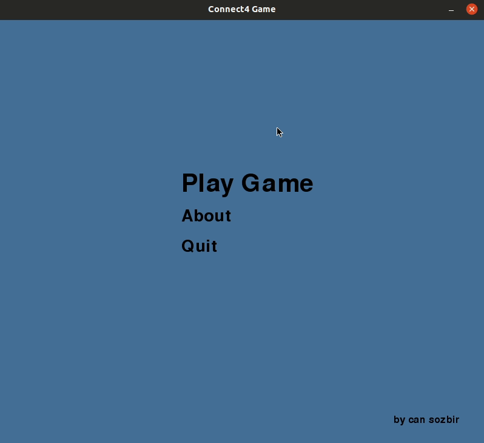

# Connect-4
Connect 4 game with AI, written in Python.
I tried to make an AI which is unbeatable in "connect-4" with Deep Learning methods.
##### Building
```git clone https://github.com/cansozbir/Connect-4.git  /type/your/path```

##### You should also install dependencies
```pip install -r requirements.txt```

##### Play Game !
```python3 /type/your/path/main.py```

##### For developers

Model's architecture : 
    input > FC(42) > BatchNorm > FC(64) > FC(64) > FC(64) > FC(42) > FC(3,softmax) > output

Model's validation accuracy is %99 but it doesn't play the game good enough. And I think that's because of the dataset. It's created with ~9 million random games but i'm not sure about it's homogeneity.
If you have any suggestions, let me know!
Dataset : https://drive.google.com/open?id=17XbCd5BL20AJLTb_oAuKcZrhyHHHeMli
##### Screenshots



